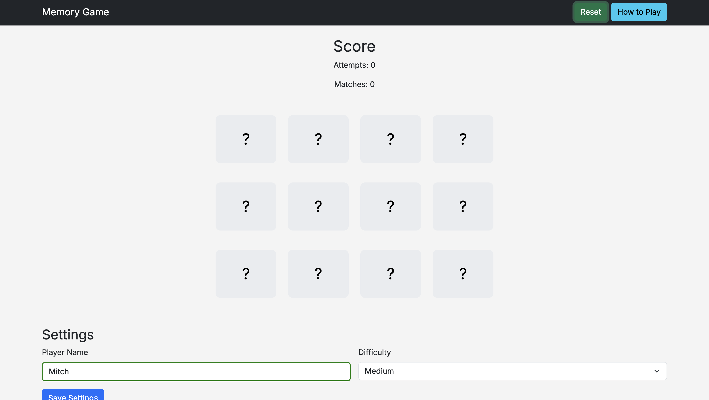

# Memory Match Game

## 📅 Date
April 2026

---

## 🎯 Objective
This project is a single-page memory matching game where players flip cards to find matching pairs. The goal is to complete the game using the fewest number of attempts.

---

## 🎮 How to Play
1. Click on a card to flip it.
2. Click a second card to try to find a matching pair.
3. If the cards match, they stay flipped.
4. If they do not match, they flip back over.
5. Continue until all pairs are matched.
6. Try to finish with the lowest number of attempts.

---

## ⚙️ Features
- Dynamic game board generated from an array of objects
- Randomized card order each game (shuffle algorithm)
- Score tracking (attempts and matches)
- Reset button to restart the game
- Settings form (player name and difficulty)
- Data persistence using localStorage
- On-screen win message (no browser alerts)
- Console-based easter egg feature
- Responsive layout for mobile and desktop

---

## 🛠️ Technologies Used
- HTML5 (semantic structure)
- CSS3 (custom styling, variables, responsive design)
- Bootstrap 5 (layout and components)
- JavaScript (ES Modules)
- localStorage (data persistence)
- GitHub Pages (deployment)

---

## 📂 Project Structure
/ (root)
index.html
/scripts
  game.js
  storage.js
/styles
  game.css
/images


---

## 📸 Screenshot


---

## 💻 Code Example

Below is the shuffle function used to randomize the game board each time a new game starts:

```javascript
function shuffleArray(array) {
  const shuffled = [...array];

  for (let index = shuffled.length - 1; index > 0; index--) {
    const randomIndex = Math.floor(Math.random() * (index + 1));
    [shuffled[index], shuffled[randomIndex]] = [shuffled[randomIndex], shuffled[index]];
  }

  return shuffled;
}

This ensures that the cards appear in a different order every time the game is reset, providing a unique experience for each playthrough.

💾 Data Storage

The game uses localStorage to persist:

Best score (fewest attempts)
Player settings (name and difficulty)

This allows data to remain available after refreshing the page.

🎁 Easter Egg

A hidden feature can be triggered through the browser console:

Open Developer Tools

Enter:

enableSecretTheme()

This activates a hidden theme on the page.

♿ Accessibility & Standards
Semantic HTML elements (nav, main, footer)
Accessible form validation
aria-live region for score updates
Keyboard-friendly interactions
Passed HTML validation (Nu Validator)
Passed WAVE accessibility checks
🔗 Live Site

👉 https://mchaffee24.github.io/game/
